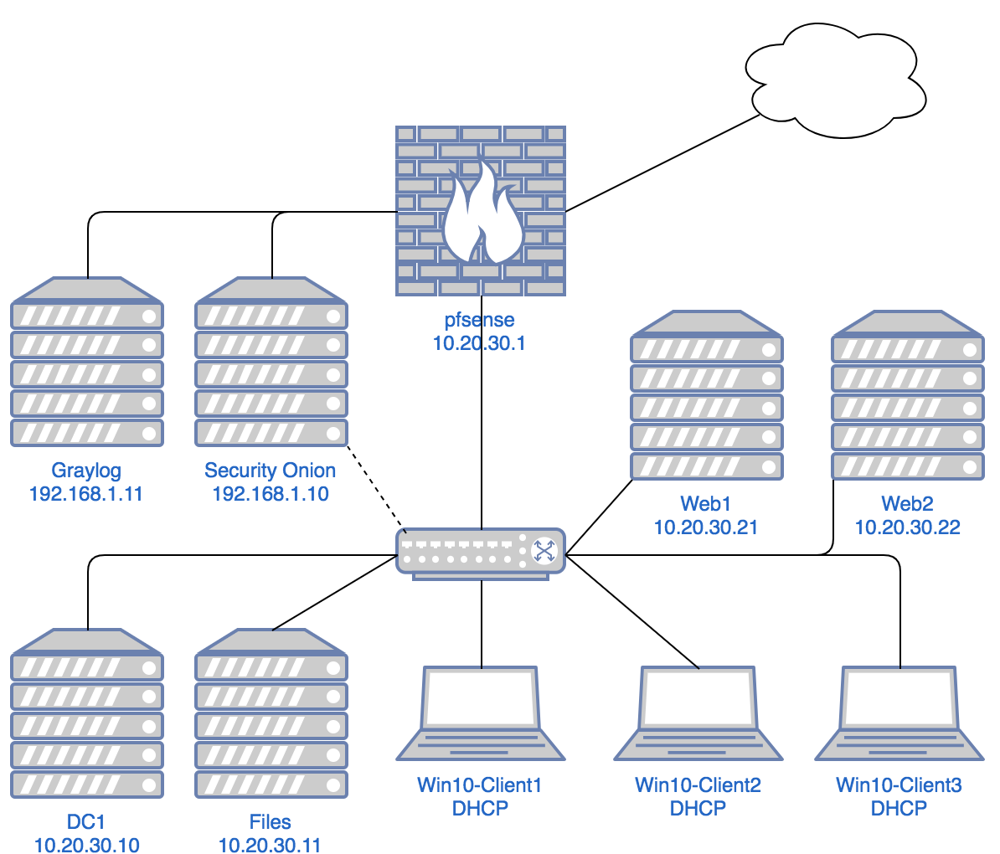

***********************
Lab 11 - Final Exercise
***********************

Overview
========

VeryGood Technologies Inc. believes that they have had a breach. VG
Tech. believed that their network was 100% secure and didn’t believe
they needed an incident response capability. They have hired your
company, Incident Responders LLC, to help with the response. You have
shown up on location with your laptop and virtual machines ready to
assist with the response. As a contractor, you are only given access to
the logging system to start.

Guidelines
==========

1. You only have access to Graylog and Security Onion’s Kibana on the
   network

2. You cannot make any changes to the network or the connected systems

RFI
===

You man request data from the systems through the network owners. The
following list contains reasonable items to request:

1. Files from specific systems

2. Security configurations (Sysmon, event forwarder, etc)

3. Logs not connected to the logging system

Other information may be available upon request.

Output
======

As you are working through the logs and finding suspicious items keep
thorough notes of what you find. This information should inform a post
response report. Some information that should be included in the report.

1. How the attacker(s) got in

2. What they did once they were in the network

3. What data left the network

Connecting to the systems
=========================

| Graylog
| http://192.168.1.11
| username: user
| password: Password1!

| Kibana
| https://192.168.1.10/app/kibana
| username: user
| password: Password1!

Network Diagram
===============

VeryGood Technologies has provided the following diagram. They do
believe it is up to date, we’ll see if this is the case…

|image0|

