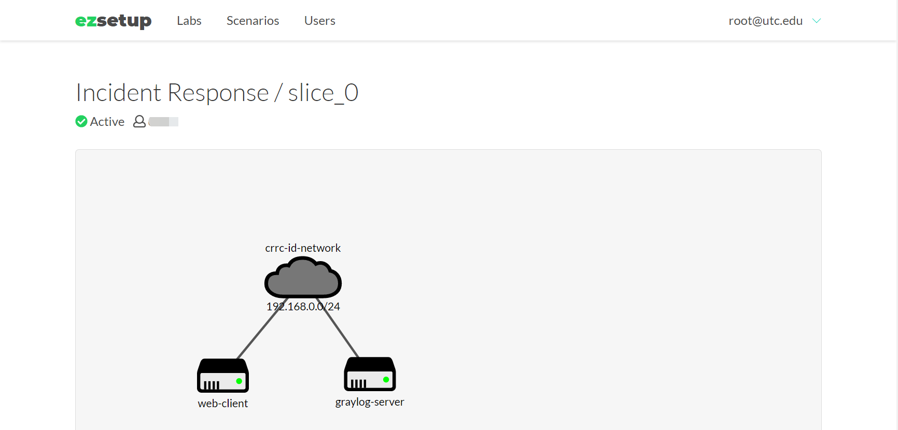
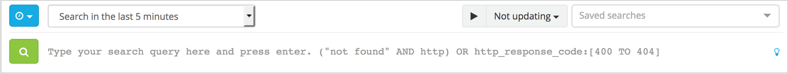
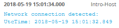

*********************
Lab 5 - Graylog Intro
*********************

In this lab, you’ll begin to become familiar with searching in Graylog.

1. If you haven’t already, start the Graylog Virtual Machine.

   a. If you start Graylog via Virtual box, you should see a message in
      the VM with its IP address after booting up.

   b. If you use EZSetup, you can access **Incident Response** lab open
      http://192.168.0.10 in the browser in the web-client VM to access
      Graylog service.

..

   |image0|

2. When you open Graylog in a web browser, and log in.

   a. Default username and password is admin

3. Click the Search tab

   a. By default, you will see a summary of all messages from the past
      15 messages

|image1|

b. Pictured above is the search bar.

c. Next to the blue icon is the timeframe. For this lab, set the
   timeframe to Search in all messages.

   i. For the best performance in production, choose the shortest
      timeframe possible

d. To the right is a play button and dropdown that will allow your
   search to continually update with new data that is pushed to Graylog.
   Keep this as Not updating for this lab.

e. To the right of the green icon is the search query area. Your
   constructed search queries will go here.

   i. Searching with an empty query will search for all messages on the
      server.

4. In the *Search result* box, find the source field. Click the arrow
   next to source, and click Quick Values to see which sources sent the
   most data.

5. Limit the search to messages from the Intro-Host source.

   a. In the search query, enter source:Intro-Host and click enter.

      i. You should see 1856 messages

6. Run a quick values analysis on the EventID field. You should see a
   majority of the messages have an event ID of 3

7. Review Graylog’s search query language syntax here:
   http://docs.graylog.org/en/2.4/pages/queries.html#search-query-language

8. Search for all messages containing “chrome”. You should have 272
   messages.

   a. You will need to search where source equals Intro-Host and for the
      string chrome

      i. Include the AND keyword. Without it, you are searching for
         messages that either contain chrome OR have a source of
         Intro-Host.

   b. ``source:Intro-Host`` AND ``chrome``

   c. Click on the first event to expand it– it should say ``Network
      connection detected:`` like in the screenshot below.

      |image2|

   d. By expanding the event, you can see all the fields related to it.

