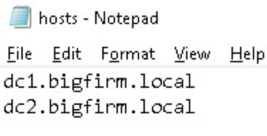

**************
Lab 10 - Kansa
**************

1. Log in to the Windows 10 VM using the password ``Password1!``

2. Right click on PowerShell in the bottom task bar, and click Run As
   Administrator

3. Run the following commands

   a. ``Set-ExecutionPolicy Unrestricted -Force``

   b. ``cd C:\Users\DSU\Desktop\Kansa-master\```

   c. ``ls -r \*.ps1 \| Unblock-File``

4. Before we run Kansa, generate a file with a list of hosts to run
   Kansa against

   a. | Open notepad and create a new document with two computer names
        on two lines. Save the document as hosts.txt in the Kansa-master
        directory.
      | |image0|

5. Run Kansa against the two servers

   a. ``.\kansa.ps1 -TargetList .\hosts.txt -Credential
      BIGFIRM\Administrator``

      i. Provide the password in the popup box ``Password1!``

6. Take a look at the data you just collected

   a. In the Kansa-master directory, you should see an ``Output\_
      directory``. Open that directory up and explore the contents.


