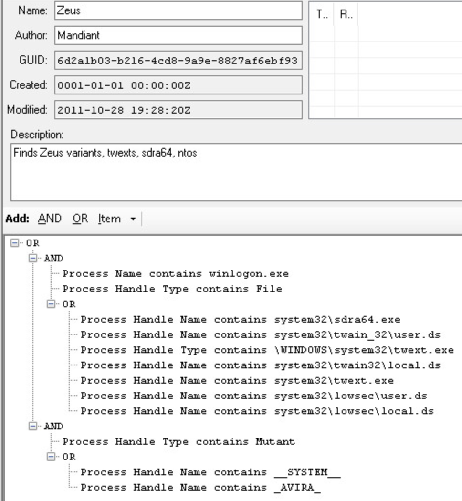

***************
Lab 4 - OpenIOC
***************

In this lab, you’ll take a look at some Indicators of Compromise with
the OpenIOC Editor. You’ll also create one of your own.

1. Install the Mandiant IOC Editor on a Windows machine

   a. The installer is included on your flash drive

   b. It is already installed on the Windows 10 VM in the IA Lab, if you
      choose to use that

2. Open Mandiant IOCe

   a. The tool will ask you to open a folder of IOCs. Open the
      openioc_examples folder

3. Using the provided example IOCs, become familiar with the syntax.

   .. admonition:: Remember!
      
      - All sides of a boolean ``AND`` expression must be true for the statement to evaluate to true.

      - One or more sides of a boolean ``OR`` expression must be true for the statement to evaluate to true.
      
   ..

    |image0|

   c. Note the metadata at the top, and the rule itself at the bottom

4. Create your own IOC based on the following intelligence

   a. ``File`` -> ``New`` -> ``Indicator``

**Name:** SneakyKey

**Category**: Backdoor

**Family**: SNEAKY

**Description**: This SneakeyKey backdoor creates an open port on the
affected system on port 1234, and allows attackers backdoor access into
the system

**MD5**: 3517fb6a19bdf4c45032cac6b232ea58

**Filename**: sk.exe -or- sneak.exe -or- k.exe

**File** **size**: 5399

**Directory**: \\Temp -or- \\Temp\key

**Strings**:

   Sneaky

   Bakup

   P1234

When you are finished, your IOC should look like this:

|image1|

