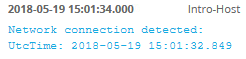
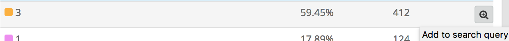

**************************************
Lab 8 - Sysmon, Windows Logs - Warm-up
**************************************

In this lab, you’ll begin to get familiar with some of the types of data
we have available from Sysmon.

1. If you haven’t already, start the Graylog Virtual Machine.

   a. When Graylog boots up, you should see a message in the VM with its
      IP address.

2. Open Graylog in a web browser, and log in.

   a. Default username and password is admin

3. Click the Dashboards tab

   a. Create a new dashboard called ``Lab 08``

      i. You’ll be adding information to this dashboard later on.

4. The dataset for this lab can be obtained by limiting the source and
   searching for messages over all time.

   a. In the search query, enter ``source:Intro-Host`` and click enter.

      i. You should see 1855 messages

5. Search for all messages containing ``chrome``. You should have 272
   messages.

   a. You will need to search where source equals Intro-Host and for the
      string chrome

      i. Include the AND keyword. Without it, you are searching for
         messages that either contain chrome OR have a source of
         Intro-Host.

   b. ``source:Intro-Host`` AND ``chrome``

   c.  Click on the first event to expand it– it should say  ``Network connection detected:`` like in the screenshot below.

       |image0|

   d. Note the different fields available in the message.

   e. Fill in the information from the following fields:

 ::

   DestinationIP: ___________________________

   DestinationHostname:___________________________

   DestinationPort: ___________________________

   EventID: ___________________________

   Image: ___________________________

   SourceIp: ___________________________

   SourceName: ___________________________

   User: ___________________________

6.  Construct a search to find messages where source is Intro-Host and
    SourceName is Microsoft-Windows-Sysmon

    a. You should have 1378 messages

    b. Under the Search result section, look under the fields for
       EventID

    c. Click the down arrow next to EventID, and click Quick values

    d. This will show a graph with a summary of the distribution of
       EventID over all messages matching your search.

       i.  What EventIDs are the most common? What Sysmon event do they
           corespond to?

       ii. Click Add to dashboard, and choose this lab’s dashboard. Call
           the Widget ``Sysmon Event IDs``

7.  | Click on the the magnifying glass with a plus symbol next to the
      EventID 3 to add it to the search query.
    | |image1|

    a. Click enter to run the search, and remove the Quick Values for
       EventID.

    b. Open a Quick Values chart for the Image field

       i.  What images made the most network connections?

       ii. Click Add to dashboard, and choose this lab’s dashboard. Call
           the widget “Network Connections by Process”

8.  Add ``Image:*chrome\*`` to the search query.

    a. Note: the asterisks are wildcards that will match all messages
       with chrome in the image path.

    b. Click the down arrow next to DestinationIp_geolocation and select
       World Map

    c. Add the map to the dashboard, and call it Destination Location

9.  Construct a search to find all Sysmon Process Creation events

    a. You should have 403 messages

    b. Generate a Quick Values chart for the Image field to see the most
       commonly created processes. Add this widget to the dashboard.

10. Pull all the messages from the Security event log by searching where
    the SourceName is Microsoft-Windows-Security-Auditing

    a. You should have 475 messages

11. Search for all successful logon messages

    a. Hint: EventID 4624

    b. View the Quick Values for the TargetUserName field.

    c. Exclude all events with Logon Type 5.

       i. Type 5 is service logons.

    d. Add the Quick Values widget to the dashboard, call it User Logons

    e. Note: A failed logons widget can be useful too, but there is no
       data in this dataset for failed logons.

12. Go to the dashboards tab to take a look at the dashboard you’ve
    created.

    a. Feel free to rearrange the dashboard to your liking.

    b. If time permits, continue searching through the data for some
       potentially useful information to add to the dashboard.

