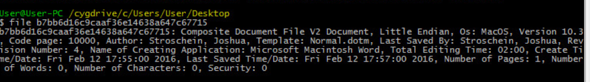
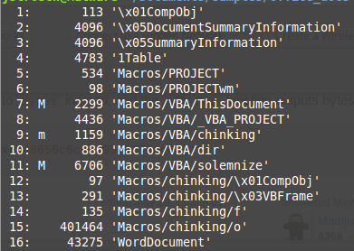
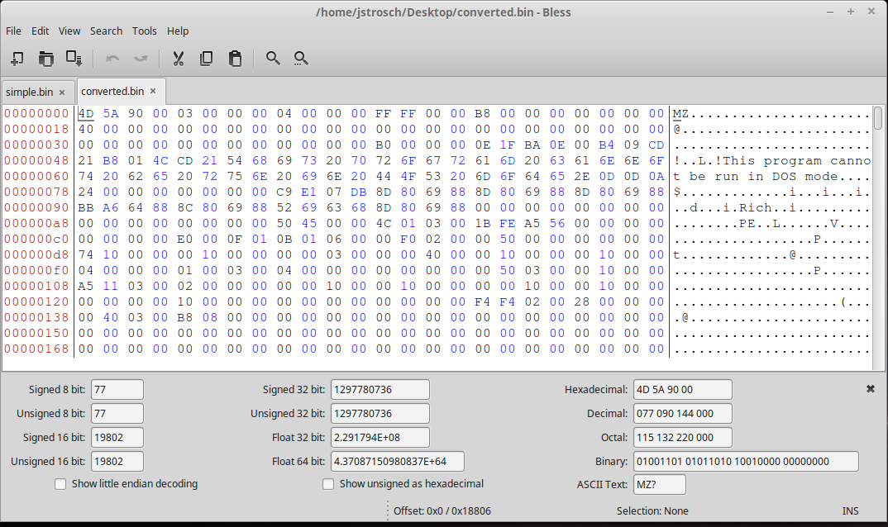

**************************
Analyzing Office Documents
**************************

For this lab we’re going to be working with **oledump** from Didier
Stevens. It is already in the VM: ``C:\Users\User\Desktop\Malware_Tools\scripts\oledump``. You can optionally
download **oledump.py** from: `<http://blog.didierstevens.com/programs/oledump-py/>`_

You may need to install additional dependencies to get the script to
work. Once you have the script working, review the documentation by
invoking the script:

.. code-block:: console

    $ python oledump.py -m

You may want to pipe it through **more** to allow you to read all of the
output:

.. code-block:: console

    $ python oledump.py -m \| more

Use these tools as well as anything else you’re familiar with to analyze
the following files:

File 1 - MD5: ``b7bb6d16c9caaf36e14638a647c67715``
--------------------------------------------------

-  | Use the **file** utility from a Cygwin terminal to inspect the
     file:
   | |image0|

-  Use **Oledump** to inspect the file, does it contain macros? If so,
   inspect them.

-  Is this file malicious?

File 2 - MD5: ``1b0fbd5e0af361058a8115b941232e34`` (from UPS phishing campaign)
-------------------------------------------------------------------------------

OLE files can be viewed as an archive containing **streams** and
**storage**. Streams will appear as embedded data within an OLE
container. Storage will appear as folders and can contain other streams
and storages. Perform the following tasks:

-  | View the streams, which streams contain macros? Your output should
     look similar to the following:
   | |image1|

-  Extract and inspect the macros, what function is used to execute the
   macros?

-  Do any other streams look interesting/worth inspecting? Why or why
   not?

-  Is this file malicious?

File 3 - ``78989bc304554d5dfe1bbea3794cd0b`` - Drops Dridex?
------------------------------------------------------------

-  What file type is this sample (ie Word, PowerPoint, etc)?

-  The macro code makes a connection to a URL, what is the URL? Use
   static analysis only!

   .. admonition:: Hint!

      You won’t find it as ASCII text, you will need to convert integer values into chars. I wrote a small (~ 5 lines) Python script to do the work for me.

Final Task:
-----------

File 2 (``1b0fbd5e0af361058a8115b941232e34``) contains an embedded
EXE, find the executable and extract it - confirm that you have a PE
file by analyzing it (run **file** on it, upload to VirusTotal, etc). I
wrote a small Python script to help me ‘convert’ the embedded content
into the EXE. Once you’ve done it correctly you should see something
similar to the following in a HEX editor:

|image2|

Deliverable:
------------

A Word Document or PDF with answers to the lab questions.

