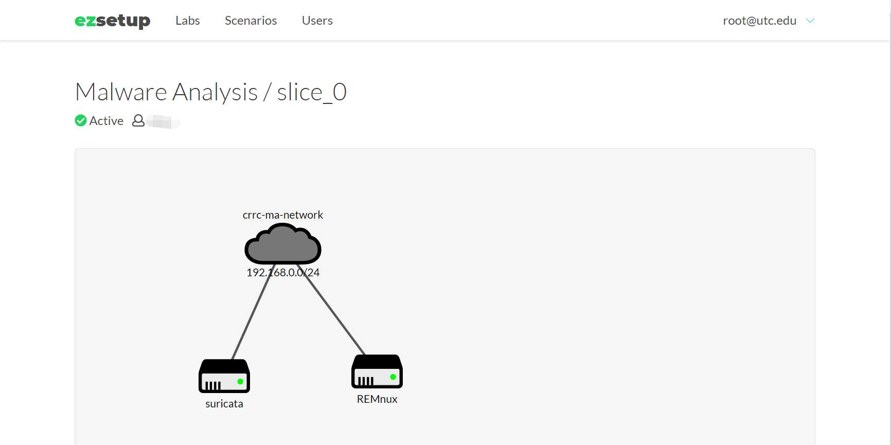
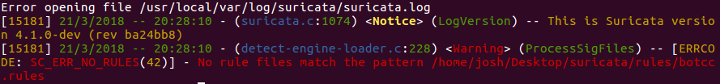

**********************
Suricata Configuration
**********************

Overview
--------

The goal of this lab is setup and configure Suricata.

1. You can do this in your own virtual machine, you can download an
   Ubuntu 16 VM from the lab folder. This is in an open format (.ova
   file) and you should be able to import into any virtualization
   software. Once you have the VM running, you can log in with the
   account ``josh`` and a password of ``password``.

2. You can access EZSetup dashboard and view your **Malware Analysis**
   lab. You can see the topology like the following screenshot. You can
   log in the suricata VM with default account ‘ubuntu’ and its password
   via SSH or noVNC.

|image0|

   On the desktop is the Suricata source, you will be building Suricata
   from this source and NOT from the Ubuntu PPA.

All of the documentation can be found at https://suricata-ids.org/docs/

For this lab, you will be using the Quick Start Guide for installation,
setup and finally testing.

Building Suricata
-----------------

Follow the instructions from the quick start guide - Ubuntu Installation
from GIT:
https://redmine.openinfosecfoundation.org/projects/suricata/wiki/Ubuntu_Installation_from_GIT.

The pre-installation requirements have already been met, so you can skip
that. Perform the following tasks:

-  Begin in the “Suricata” section, at the command ``./autogen.sh``,
   follow these instructions to the end of that section (do not move
   into the Auto Setup section)

No deliverable is needed for this task.

Basic Setup
-----------

Now you’re ready for basic setup, Suricata isn’t ready to run
out-of-the-box. Follow the guide “Basic Setup”:
https://redmine.openinfosecfoundation.org/projects/suricata/wiki/Basic_Setup

-  You can (and should) skip the “Auto setup” and “Setting Variables”
   sections. There is discussion here on rules, this will come in the
   next section.

-  The primary goal is to ensure that Suricata is working, these are the
   last steps in this part of the guide. You will need to modify
   ``suricata.yaml``, instructions are located in this file. Address any
   errors you encounter when testing the engine.

-  | You may encounter the following error:
   | |image1|
   | This is due to a lack of rule files, these will be installed in the
     next section.

.. note:: Provide a screenshot showing Suricata running along with the content of ``stats.log``. Also, detail any difficulties you encountered at this step.

Rule Management
---------------

The last step is to update your rules. These are configured in
suricata.yaml and can be obtained from Emerging Threats. Follow the
guide “Rules Management with Oinkmaster” -
https://redmine.openinfosecfoundation.org/projects/suricata/wiki/Rule_Management_with_Oinkmaster.

-  You do NOT need to setup Oinkmaster as a cron job, just run it
   manually to get the rules based on your ``Suricata.yaml`` file.

-  Once you have rules installed, you may encounter additional
   configuration errors. You will need to resolve all ERRORs produced
   when running Suricata.

Once you have the latest rules, run Suricata in offline mode against the
PCAPS on your desktop. These PCAPs should generate an alert, to see if
it did inspect the contents of *\*.log*.

**Deliverables**

Turn in a Word document or PDF with your lab report - please do **NOT**
archive your submission.

