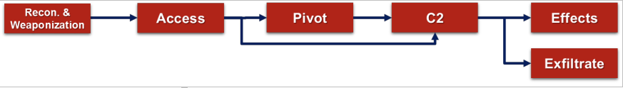
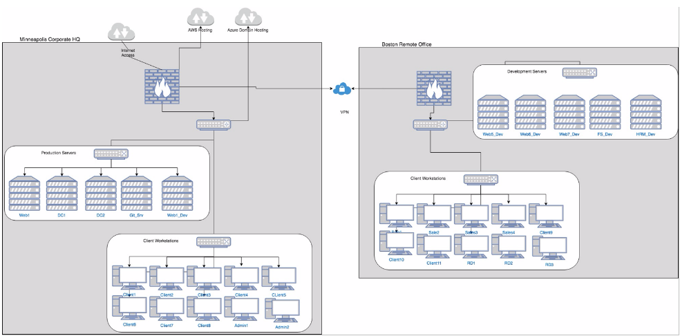

=======================
Lab 5 - Threat Modeling
=======================

Overview 
--------

In this assignment you are tasked with coming up with hypothetical
scenarios based on the documentation given to you for XYZCorp. Below you
will find a diagram of the network. Your job is to come up with **2** of
each of the following attacks from the kill chain totaling 8 attacks:

-  Access/C2

-  Pivot

-  Effect

-  Exfiltrate

   Figure 1: Cyber Kill Chain from DoD Cyber Table Top Guidebook

There are limited details on the network since during OSINT we may not
be able to collect every single detail. It is also left vague, so you
don’t have to worry about the details as much such as whether or not
there is a vulnerability in a version number of a particular piece of
software. For example, you could say that your access is gained through
a vulnerability in a web application. If you start to create ideas that
you think are less likely, you can supplement them with more assumptions
in the attack.

**XYZCorp Mission and Timeline**: To conduct timely business selling
products and services to its customers.

You also need to create **1** chain of your attacks mapped together.
Take an access and explain how it could be used in conjunction with a
pivot and effect. Explain why the access enables you to pivot where you
want to go to create the effect you want to create.

.. important:: Remember: Think like a hacker and be creative!

   Figure 2: XYZCorp Network

Example Attack: Phishing
------------------------

*(You cannot use this as one of your attacks)*

**Attack**: Access

**Attack Description**: Malicious user will attempt to gain access to
the network by sending phishing emails to users on the network. This
will result in low level user access to a domain connected system. In
rare circumstances a privileged user may be compromised.

**Assumption**: Users will click on a phish.

**Attack cost and effort**: Low, finding email addresses for a given
organization is not challenging. Creating a phishing email is not
difficult, anyone could do it. (Add in who is the actor you are
emulating, e.g. anyone, script kiddie, talented hacker, nation state
adversary, insider threat).

**Likelihood**: [Use scale of 1-5 with description] 5, High likelihood
of a phish being clicked on by a user.

**Result**: User level access to the system

**[IF ATTACK IS EFFECT OR EXFILTRATE] Impact**: (How does this impact
the organization in short and long term?

Other Ideas:
------------

1. Supply chain

   a. Compromised hardware

      i. Peripherals (keyboards, mice)

2. Physical access

3. USB Droppers

4. Wi-Fi

5. Web applications

6. VPN applications

7. Core business functions

8. Users

   b. Which service they are the administrator of

9. Cyber-attack causing kinetic effects
10. 