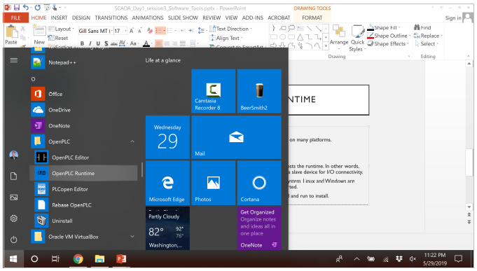

================================
Lab 1 - Install OPENPLC Software
================================

| **Estimated Time: 3 hours**
| **Purpose:** The purpose of this Lab exercise is to install software
  needed to use the OpenPLC.
| **Objective:** You will install the OpenPLC runtime, editor, the
  Arduino IDE, and the SCADABr human machine interface.
| **Lab Setup and Requirements:** You will need access to the internet
  or a flash drive with all software.

Install the software
====================

Step 1: Install the OpenPLC runtime. This will also install the OpenPLC
Editor.

-  Go to `<http://openplcproject.com/getting-started>`_

-  Select OpenPLC runtime

-  Select Windows under “SOFT-PLC”

-  Download and run the windows installer.

-  This step takes 10-20 minutes (the install portion).

   Figure 1: After the install you can find OpenPLC in your Windows start menu.

Step 2: Install the Arduino IDE.

-  | The Arduino Firmware is available here:
   | `<https://www.openplcproject.com/getting-started-arduino>`_

-  Choose the firmware for UNO.

-  The download is a ZIP file.

   -  Extract the Zip

-  Open the firmware in the Arduino IDE and open in the Arduino IDE
   (select the OpenPLC_Uno.ino when opening).

-  Upload the firmware to the Arduino

   -  Connect your USB cable

-  CTRL-U to upload (or press the → button)

-  You may need to connect the com port. If so, use

..

   Tools -> Port -> Set COM3

-  Use the right arrow button on the graphic below (in the IDE software)
   to load the firmware.

Step 4: Install Virtual Box. This is a virtual machine client.

-  SCADABr is distributed as a Virtual Box VM image.

-  Download Virtual Box here: https://www.virtualbox.org/wiki/Downloads

-  Install.

-  Note: there is also a link to SCADABr here:
   https://www.openplcproject.com/reference-installing-scadabr

Step 5: Install the SCADABr Virtual Machine (VM).

-  Download the SCADABr .ova file at
   https://www.openplcproject.com/reference-installing-scadabr

-  Save the .ova file in a location where you can find it.

-  Launch Virtual Box

-  Use File -> Import Appliance to install the SCADBr ova file.

-  Change the SCADABr VM network settings to Host Only Adapter.

   -  While the SCADABr VM is off select Settings

   -  then select Network

   -  Set “Attached to:” to “Host-only Adapter”

   -  The Host Only IP address can be found (and set) under Preferences
      -> Network -> Host Only Networks

   -  Select the appropriate adapter

..

Instead of doing step 4 and 5 to install ScadaBR VM, you can access the
Scada lab on **EZSetup**. In the Scada lab, you can see the topology
like the screenshot below.

Launch the Tools
================

Step 1: Launch the OpenPLC runtime

-  This tool is launched from the Windows start menu.

-  Simply launch the runtime and then let the tool run in the
   background.

-  The runtime will open and run in a command window.

Step 2: Launch the OpenPLC web interface.

-  When the runtime is operating correctly it will launch a web server.

-  Use your browser to open the web interface.

-  Go to this address: http://localhost:8080 (aka. http://0.0.0.0:8080)

-  Login to the web interface

   -  Username: openplc

   -  Password: openplc

Step 3: Launch the Arduino IDE

-  Launch the IDE from the Windows start menu.

-  Load the OpenPLC Arduino Uno firmware (ino file).

   -  Open the firmware in the Arduino IDE and open in the Arduino IDE
      (select the OpenPLC_Uno.ino when opening).

   -  Upload the firmware to the Arduino

      -  Connect your USB cable

   -  CTRL-U to upload (or press the → button)

   -  You may need to connect the com port. If so, use: Tools -> Port ->
      Set COM3

-  On subsequent launches you can open the IDE and click the right arrow
   button on the graphic below (in the IDE software) to reload the
   firmware.

Step 3: Launch the SCADABr VM

.. note:: You will not login to this VM. It will simply run in the
         background. SCADABR is notoriously difficult to install natively and it
         is not an OpenPLC product. As such, OpenPLC chooses to distribute a VM
         with SCADABr installed.

-  Launch Virtual Box from the Windows start menu.

   -  Look for Oracle VM Virtual Box.

-  Right click on the SCADABR VM in your list of VM’s and select start
   (double click the SCADABR VM in the list).

After the SCADABR VM boots it will display a URL on its splash screen.
Take note of the IP address on this screen. You will open this URL in
your browser.

If you utilize **EZSetup**, you can open a browser on your **host**
system and enter the URL in your browser. The URL is **http://<ScadaBR’s
floating IP>:9090/ScadaBR**. And The default username and password are
both \ **admin**.

Step 4: Launch the OpenPLC Editor

The editor is available via the Windows start menu.

Next: in the next lab we will use the OpenPLC tools to create control a
circuit.
