===============================
Lab 2 - Introduction to OPENPLC
===============================

| **Estimated Time: 3 hours**
| **Purpose:** The purpose of this Lab exercise is to familiarize the
  student with the OpenPLC.
| **Objective:** You will use the OpenPLC editor to write ladder logic
  and save in a format to upload to the OpenPLC. You will use the
  OpenPLC runtime on a Windows PLC connected to a Arduino Uno as a slave
  device (for input and outut). Your PLC will monitor two buttons and
  control an LED.
| **Lab Setup and Requirements:** The student will need to have
  installed the OpenPLC runtime for Windows, the OpenPLC editor, and a
  Arduino Uno plus bread board.

Web version of lab:
https://www.openplcproject.com/reference-your-first-project

Step 1: Connect your Arduino Uno to your PC. The Aruduino Uno schematic
and pin out are here:
https://www.openplcproject.com/getting-started-arduino (scroll all the
way down).

Step 2: Start the OpenPLC runtime. Find OpenPLC in your computer’s start
menu and select the OpenPLC runtime.

Step 3: Start your browser and log into the OpenPLC web interface. The
IP address for the OpenPLC web interface is http://0.0.0.0:8080
(localhost:8080).

-  Credentials: user: openplc, password: openplc (you can create your
   own account).

Step 4: Add a slave device for the Arduino Uno. Follow the instructions
here: https://www.openplcproject.com/getting-started-arduino

Step 5: Start the Arduino IDE.

-  Load the OpenPLC firmware.

Step 5: Build the circuit shown in Figure 1 on your bread board.

Tips:

1. The figure shows a generic OpenPLC. You are connecting to pins on the
   Arduino Uno.

2. There is no resistor shown before between the LED and the PLC. Add
   one to avoid burning your LED. Use between a 1K – 10K ohm resistor.
   The lower the resistance the brighter the LED.

3. R1 and R2 are pull down resistors. All input pins that you use should
   have a pull down resistor between 1K and 10K ohms. Note: without the
   pull down the pin will “float”. This will cause unpredictable
   behavior which is unpredictable and therefore hard to debug.

4. The pin numbers for Arduino Uno are slightly different. Use %IX100.0,
   %IX100.1 and %QX100.0 (use the values in the OpenPLC editor).

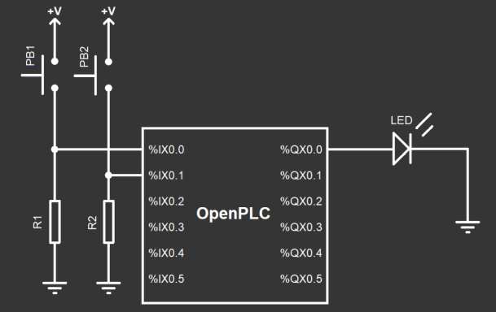

   Figure 1: Lab 2 Circuit

Step 5: Write your ladder logic.

-  Use File -> New on the OpenPLC editor main screen, see Figure 2, to
   create a new project.

   -  Create a folder first. Select this folder to hold your project
      files.

   -  Name your folder: “My First Project”

   -  Select the folder (don’t click into it)

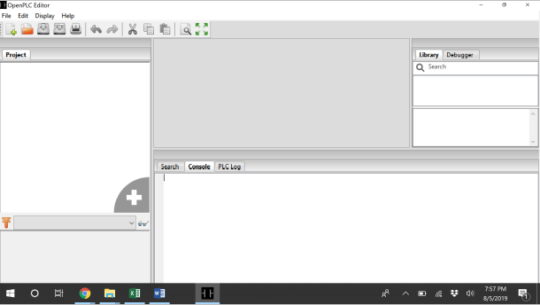

   Figure 2: OpenPLC Editor Main Screen

After selecting your folder a “Create a new POU” window will pop up. See
Figure 3.

-  Leave the program name as program0.

-  Change the Language to “LD”. LD stands for ladder (as in ladder
   logic).

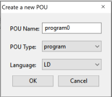

   Figure 3: New program pop up

Add your inputs and outputs to the variable window.

-  Click the + sign to add a row to the list of variables.

-  Remember the locations for Arduino Uno are %IX100.0, %IX100.1, and
   %QX100.0.

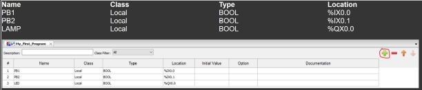

   Figure 4: The variable window.

What we want to achieve with this program is that whenever PB1 is
pressed, the LAMP turns on, and remains on until PB2 is pressed. This is
achieved by a simple ladder logic latch circuit like this:

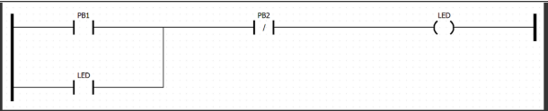

To create this circuit on the editor, start by adding a left power rail
by clicking on the power rail icon on the toolbar.

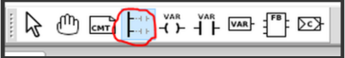

Adjust the left power rail pin count to 2 and stretch it a little bit so
it can fit both rungs comfortably. Then add a contact by clicking on the
contact button on the toolbar or by right clicking on the blank editor
window and selecting Add->Contact. On the window that appears, under the
"Variable" parameter, select PB1 to associate your new contact with the
variable PB1.

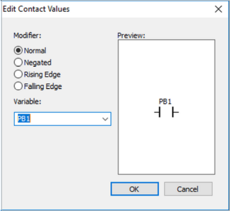

Repeat the process to add two more contacts, one associated with PB2 and
another associated with LED. For the PB2 contact, select Negated as the
modifier. Finally, add a coil by clicking on the coil button on the
toolbar or by right clicking on the blank editor window and selecting
Add->coil. Associate your new coil with the LED variable, and add a
right power rail to close the circuit. Position the components in place
so that they look like this picture:

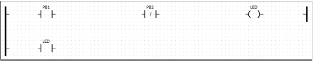

The final step is to connect all the components by dragging their
extremities to form a line. Connect the left side of PB1 and LED
contacts with the left power rail. Connect the right side of PB1 with
PB2, the right side of PB2 with the LED coil, and the right side of the
LED coil with the right power rail. Draw the parallel LED contact
circuit by connecting the right side of the LED contact with PB2. Your
final project should look like this:

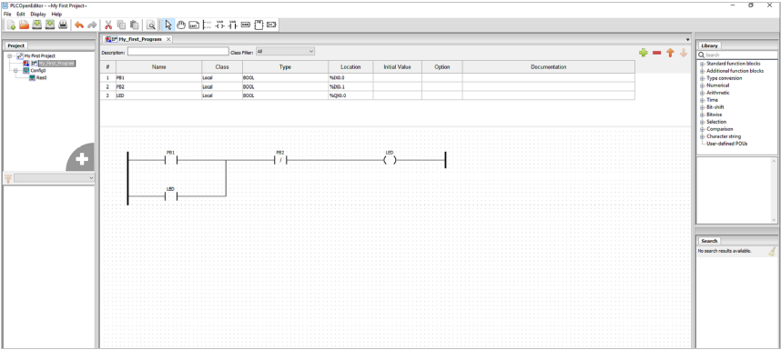

This circuit initially has the LED powered off. When you press PB1 even
for a small instant, the circuit turns the LED on (given that PB2 is not
pressed also). Once the LED turns on, it bypasses the PB1 button on the
circuit to turn itself on continuously even after PB1 is not pressed
anymore. This is a nice trick in ladder logic, you can actually use
outputs as contacts! Now, the only way to turn the LED off is by
pressing PB2. Since PB2 is a negated contact, it will open the circuit
once it is pressed, therefore turning off the LED.

Now that your project is created it is a good time to test it before
uploading it to the OpenPLC Runtime. You can simulate the behavior of
your program by clicking on Start PLC Simulation on the tool bar.

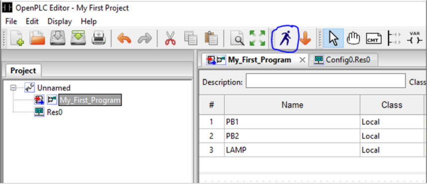

When you click on that button your project is compiled using a similar
process to the OpenPLC Runtime. If there are any errors on your program,
the compilation will fail and you will be alerted about the errors on
the Console panel at the bottom of the screen. If the compilation
succeeds, OpenPLC Editor will then start running your code. To view your
code running interactively, click on Debug instance on the left panel:

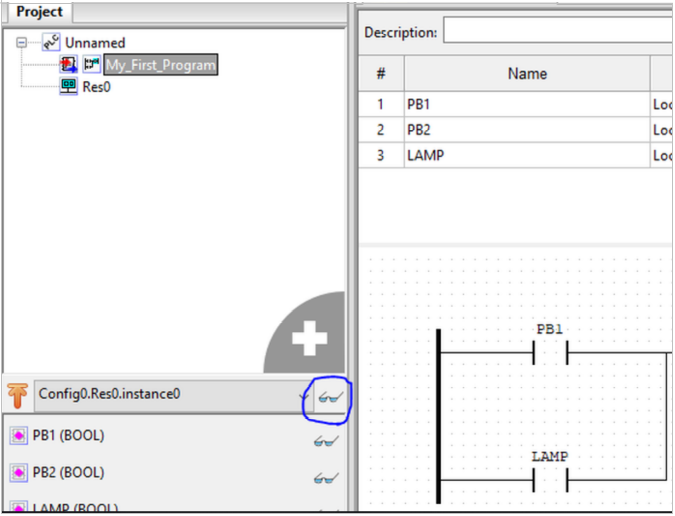

This will open a new window where you can see the electrical flow of
your program. Lines in green are activated, where lines in black aren't.
You can force a contact or coil to be activated or deactivated by
right-clicking on it and selecting either Force True or Force False. Try
forcing PB1 to be true and observe the flow path to the LAMP coil. Then
force PB1 back to false and verify that LAMP is still activated due to
the latch circuit.

​

Apart from graphically viewing the electrical flow on the diagram, you
can also follow the data in each variable of your program at the
Debugger panel on the right side of the screen. You can add variables to
the Debugger panel by clicking on the glasses icon in front of each
variable from the panel on the left. Also, by double-clicking a variable
on the Debugger panel you can see a graph in real-time showing the
current values of the variable. This can be really useful when your
program is counting steps or manipulating data.

Finally, after you have created and tested you program, the last step is
to generate your program in a format that the OpenPLC Runtime will
understand. To do that, simply click on Generate program for OpenPLC
Runtime on the tool bar and save the .st file on your computer. This
file is your ladder logic program written in a language that OpenPLC
Runtime can understand.

Navigate to the OpenPLC web interface (localhost:8080 on your browser).

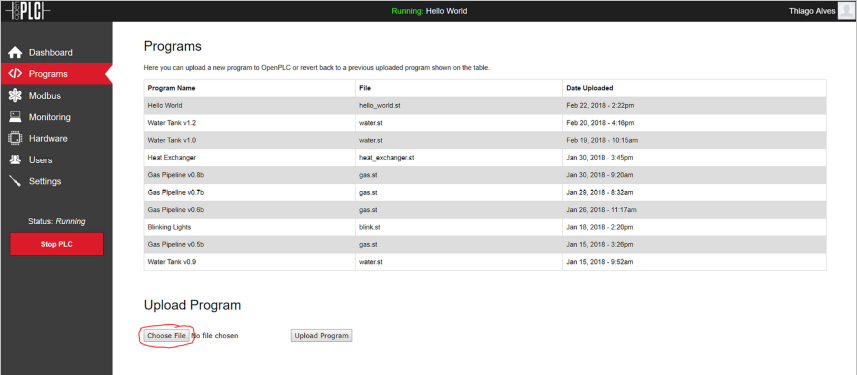

-  Click Choose file and select your .st file.

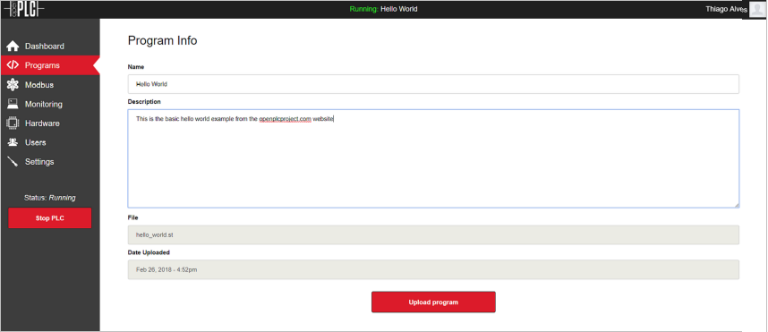

-  Add a Name. It can be anything.

-  Add a description. This is optional.

-  Select “Upload program”

-  The program will upload and compile.

-  After compiling you will return to the main browser screen and select
   “Start PLC” on the bottom left.

Your ladder logic should now be running.

-  Tx/Rx LEDs on the Arduino Uno should be rapidly blinking.

-  Try the buttons. PB1 should light the LED. PB2 should turn off the
   LED.
