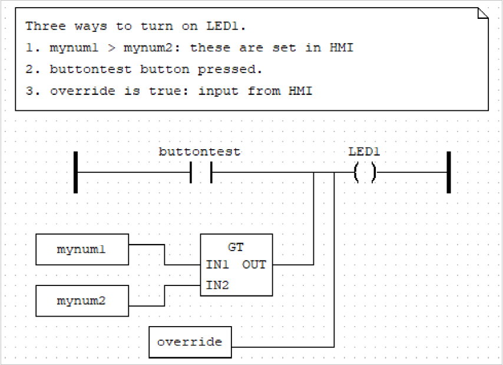

=============================
Lab 3 - Using The SCADABR HMI
=============================

| **Estimated Time: 3 hours**
| **Purpose:** The purpose of this Lab exercise is to develop an.
| **Objective:** Write a second ladder logic file for your lab 2 circuit
  and develop and HMI that allows remote monitoring and control of the
  circuit.
| **Lab Setup and Requirements:** The student will need to have
  installed the OpenPLC runtime for Windows, the OpenPLC editor, and a
  Arduino Uno plus bread board.

Step 1: Develop Ladder Logic to turn on/off a LED if any of the
following three conditions are true.

1. a button is pressed and held down

2. number1 (16-bit INT) is greater than number2 (16-bit INT)

-  number 1 and number2 should be observable and settable in the HMI.

.. hint:: Use %MW0 and %MW1 (%MW0 and %MW1 are not connected to Arduino
          pins. They are addressable memory locations writeable from Modbus.)

1. binary input (override) from HMI is 1

.. hint:: Use %QX101.0 (%QX101.0 is not connected to an Arduino pin. It is
          an addressable memory locations writeable from Modbus.)

Step 2: Add an LED in your SCADABR HMI to display the LED status.

-  Create a data source for the LED output on your circuit board.

-  | Do a point locator test for the LED variable. Translate the
     %QX100.0 address to a Modbus address. Use this value in the
     “offset” field of the point locator test. Remember to select the
     register range and data type. Once the location is found, use add
     point to save the point.

    .. figure:: media/scada_lab3_img1.png
       :align: center

-  Use a LED16 or LED24 binary graphic.

Step 3: Use simple point components to display and control number1 and
number2.

-  Create data sources for each value.

-  Label the simple point using a HTML component.

Step 4: Use a binary graphic - > Ligu/Desliga Botao component to add a
button to control and display the state of the binary input from step 1.

Solutions
=========

   Figure 1: Ladder Logic Solution
