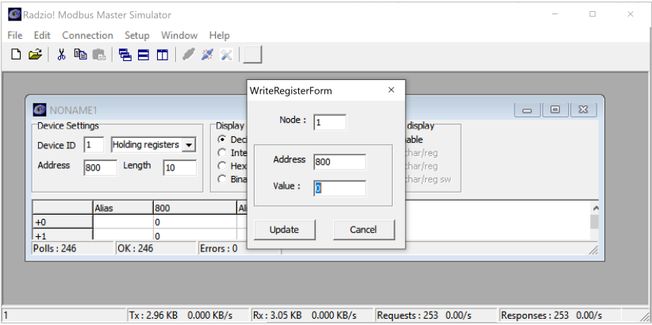

=============================
Lab 3 - Using The SCADABR HMI
=============================

| **Estimated Time: 3 hours**
| **Purpose:** The purpose of this Lab exercise is to develop an.
| **Objective:** Use Wireshark to observe Modbus traffic. Use Radzio to
  inject Modbus traffic to attack a PLC.
| **Lab Setup and Requirements:** The student will need to have
  installed the OpenPLC runtime for Windows, the OpenPLC editor, and an
  Arduino Uno plus bread board. The student will install Wireshark and
  Radzio.

Download and setup
==================

Step 1: Download and install Wireshark.

-  Wireshark is a tool that allows observation of network traffic.

-  Wireshark is available at https://www.wireshark.org/download.html

Step 2: Download and install Radzio.

-  Radzio is a debug tool for Modbus. It can be used to poll and modify
   data at Modbus addresses. Rad

-  Radzio is a easy tool to create injection attacks.

-  Radzio can be downloaded here:
   http://en.radzio.dxp.pl/modbus-master-simulator/

Step 3: Launch the SCADA system created for Lab 3.

-  Start the runtime, the HMI, and have the system operational.

Using Wireshark with MODBus
===========================

Step 4: Wireshark

-  First open Wireshark. When you open wireshark the tool presents a set
   of interfaces available for capture.

-  Select the VirtualBox Host-Only Adapter. This is the network used to
   communicate between the Windows PLC and the SCADABr HMI.

-  When Wireshark begins capturing packets you will see them streaming
   by. Whireshark will continue to capture packets until stopped. Use
   the stop button to stop the capture.

-  Double click on a Modbus packet to investigate its contents.

   -  Double click on another packet.

   -  Find a server and a client packet. Modbus servers use port 502.
      Modbus client TCP ports are ephemeral.

   -  What is the server IP address? \_________________________\_

   -  What is the client IP address? \__________________________\_

-  Choose a Modbus client to server packet. This is a Modbus request.
   What is this packet doing?

   -  What is the Modbus function code?

   -  Use the Modbus Application specification to look up the function
      code?

      http://www.modbus.org/docs/Modbus_Application_Protocol_V1_1b3.pdf

   -  Is this packet a read request?

      -  What is the Modbus address being read?

      -  How many registers are being read?

      -  Does this Modbus query match a data source in your Lab 03 HMI?

      -  Which one?

      -  *Note: Wireshark calls the Modbus address a reference number.*

-  Choose a Modbus server to client packet. This is a Modbus response.
   What is this packet doing?

   -  What is the Modbus function code?

   -  Use the Modbus Application specification to look up the function
      code?
      http://www.modbus.org/docs/Modbus_Application_Protocol_V1_1b3.pdf

   -  What request does this packet respond to?

   -  Is this packet a read response?

      -  How many bytes were returned?

      -  What Modbus address was returned?

      -  What data was returned?

We can use Wireshark filters examine all of the Mobdus packets at once.

-  First, the simplest filter is the name of a protocol. Type “modbus”
   in the wireshark filter field. This limits the display to only Modbus
   packets.

   .. figure:: media/scada_lab4_img4.png
      :align: center

-  When applying a filter, the number of packets displayed is shown at
   the bottom of the window. This is the number of packets which match
   your filter condition.

   -  How many Modbus packets are in your Wireshark capture?

-  Filters can be more powerful. Filters can match specific fields in a
   packet. For example, a filter may match a specific IP address, a
   specific TCP port, a specific Modbus function code, etc.

-  Filters can be combined with combinatorial logic (and, or, etc) to be
   very specific.

-  Write a filter to show only Modbus request packets.

   -  This filter can search for all Modbus packets that have the source
      IP address. Alternatively, the filter can search for all Modbus
      packets with TCP destination packet 502. Try both.

   -  | Which of the above is more informative for the investigator?
        Why?
      | Answer: Filtering on the known Modbus address may not show
        packets from a network client you didn’t know about. Filtering
        for all packets with port 502 as the destination will show the
        know IP address and any that are not. If you really suspected a
        rogue client, a filter could look for port 502 as the
        destination when the source IP address is NOT the known good
        address.

-  Write a filter to show all Modbus packets that are “Write Single
   Register” requests. Use the expression builder. *Note: clear the
   expression field before starting a new expression.*

   -  You can look up the function code value for “Write Single
      Register” here:
      http://www.modbus.org/docs/Modbus_Application_Protocol_V1_1b3.pdf

   -  The expression builder is available via a button on the right side
      of the expression field.

..

   .. figure:: media/scada_lab4_img5.png
      :align: center

-  In the expression builder, search for Modbus. Click on the “>” symbol
   to show available Modbus expressions.

-  Scroll down to function code expression. Either type in the function
   code you are interested in or use a predefined value.

..

   .. figure:: media/scada_lab4_img6.png
      :align: center

Using Radzio
============

Step 1: Start Radzio.

-  Open the folder where you extracted the Radzio zip file. Launch the
   rmms.exe file.

Step 2: Open a connection.

-  In the Radzio tool choose Connection->Settings.

-  Change the protocol to Modbus TCP

-  Change the Modbus TCP IP Address to match the IP address of your PLC.
   This is the same IP address you configured the HMI to use.

   -  When using Virtual Box Host Only Adapter for networking the PLC IP
      address is the IP address of the host. This defaults to
      192.168.56.1. It can be looked up or changed using the
      instructions here:
      https://www.thomas-krenn.com/en/wiki/Network_Configuration_in_VirtualBox#Host-only_Networking

.. note:: You can find this IP address with NMAP. Look for IP addresses
          advertising a service on port 502.*

-  After configuring your connection, connect to the PLC server. Use
   Connection -> Connect. The bottom of the screen will now show
   connection details.

..

   .. figure:: media/scada_lab4_img7.png
      :align: center

-  Click the small white button on the top left to begin view Modbus
   data.

..

   .. figure:: media/scada_lab4_img8.png
      :align: center

-  Use the “Coil Status” drop down to change the data type. Available
   types are Coil Status, Input Status, Input Register, and Holding
   Register. Each of these has a different address range. To view data
   at a specific address and off a specific type, first set the type and
   then change the address. The length field tells Radzio how many data
   blocks (coils or registers) to fetch.

-  Double click on a data field to modify that address’s contents. This
   will cause Radzio to write to that address. If that address is
   implemented by a PLC program it will change.

-  Use Radzio to display your number1 and number2 registers from Lab 03.

-  Overwrite the contents of number1 and number2 and observe the
   response in the HMI.

-  Overwrite the contents of number1 and number2 in the HMI and observe
   the response in Radzio.

-  Radzio is essentially a light weight HMI. It is a connection testing
   tool for engineers. It can also be used to reconnoiter PLC’s to
   observe what addresses are used and to overwrite data at specific
   addresses (a simple network injection attack).
